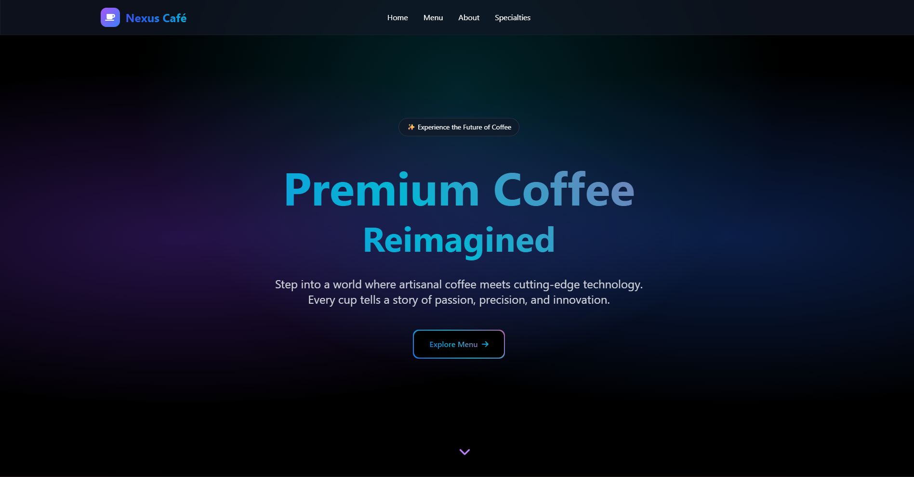
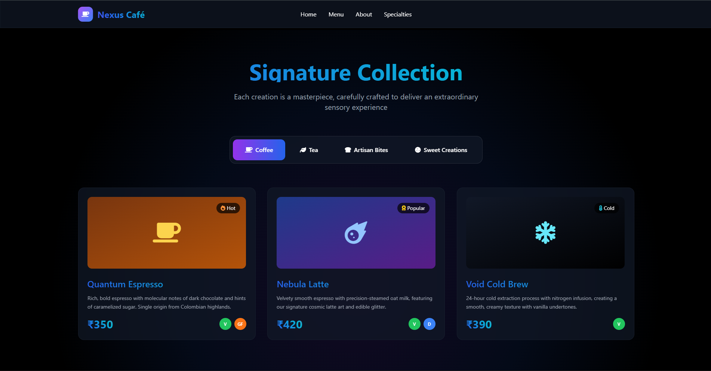
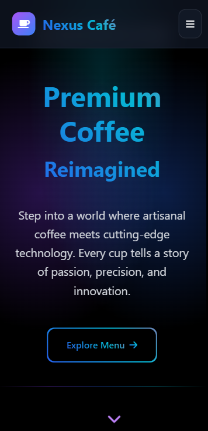

# Nexus Café - Futuristic Coffee Shop Website

A modern, animated, single-page website for a conceptual premium coffee shop named "Nexus Café". This front-end showcase project demonstrates advanced CSS techniques, responsive design, and JavaScript-based animations to create an immersive digital experience that blends cutting-edge technology with artisanal coffee culture.

## 🚀 Live Demo

[View Live Demo](https://your-demo-link-here.com) <!-- Replace with your actual demo link -->

## ✨ Key Features

### 🎨 Futuristic UI/UX
- **Dark Theme Design**: Sleek black background with strategic use of dark tones
- **Glass Morphism Effects**: Modern frosted glass aesthetic with backdrop blur
- **Vibrant Gradients**: Dynamic gradient text and borders that shift colors
- **Spotlight Effects**: Radial gradient overlays creating atmospheric lighting

### 🎬 Advanced Animations
- **Page Loader**: Animated gradient spinner with smooth fade transition
- **GSAP Integration**: Professional-grade animations using GreenSock Animation Platform
- **Scroll-Triggered Reveals**: Elements animate into view as users scroll
- **Counter Animations**: Dynamic number counting for statistics
- **Interactive Hover Effects**: 3D transformations and scaling on user interaction
- **Staggered Animations**: Sequential reveals for menu items and cards

### 📱 Fully Responsive
- **Mobile-First Design**: Optimized for smartphones and tablets
- **Adaptive Layouts**: Grid systems that reorganize based on screen size
- **Touch-Friendly Navigation**: Mobile hamburger menu with smooth transitions
- **Cross-Browser Compatibility**: Works seamlessly across modern browsers

### 🍽️ Interactive Menu System
- **Dynamic Category Filtering**: Smooth transitions between Coffee, Tea, Artisan Bites, and Sweet Creations
- **Animated Menu Cards**: Hover effects with transform animations and gradient overlays
- **Detailed Item Information**: Pricing, dietary labels, and descriptive content
- **Visual Indicators**: Icons and badges for item categories and features

### 🎯 Single-Page Layout
- **Smooth Scroll Navigation**: Seamless transitions between sections
- **Fixed Header**: Glass morphism navigation bar with gradient underline effects
- **Section Dividers**: Animated gradient lines separating content areas
- **Anchor Link System**: Direct navigation to Home, Menu, About, and Specialties sections

## 🛠️ Technologies Used

- **HTML5** - Semantic markup and structure
- **Tailwind CSS** - Utility-first CSS framework (via CDN)
- **JavaScript (Vanilla)** - Interactive functionality and DOM manipulation
- **GSAP & ScrollTrigger** - Advanced animations and scroll-based triggers (via CDN)
- **Font Awesome** - Icon library for visual elements (via CDN)

## 🚀 Getting Started

### Prerequisites
No installation or build process required. All dependencies are loaded via CDNs.

### Running Locally
1. Clone the repository:
   ```bash
   git clone https://github.com/IleshDevX/nexus-cafe.git
   ```

2. Navigate to the project directory:
   ```bash
   cd nexus-cafe
   ```

3. Open the `index.html` file in your web browser:
   - Double-click the file, or
   - Right-click → "Open with" → Choose your browser, or
   - Use a local server like Live Server extension in VS Code

### File Structure
```
nexus-cafe/
├── index.html          # Main HTML file
├── README.md          # Project documentation
└── screenshots/            # Images and additional resources (if any)
```

## 📸 Screenshots

### Desktop View - Hero Section
 <!-- Add your screenshot -->

### Interactive Menu System
 <!-- Add your screenshot -->

### Mobile Responsive Design
 <!-- Add your screenshot -->

## 🎨 Design Features

### Color Palette
- **Primary**: Purple (#7C3AED), Blue (#2563EB), Cyan (#06B6D4), Pink (#EC4899)
- **Background**: Black (#000000) with gray overlays
- **Glass Effects**: Semi-transparent overlays with backdrop blur

### Typography
- **Font Family**: System fonts with fallbacks
- **Gradient Text**: Multi-color gradients with animation
- **Font Weights**: Bold headlines, semibold subheadings, regular body text

### Animation Details
- **Duration**: 0.3s to 2s depending on element
- **Easing**: Custom cubic-bezier curves and GSAP ease functions
- **Triggers**: Scroll position, hover states, and click events

## 🌟 Key Sections

1. **Hero Section**: Eye-catching introduction with animated text and call-to-action
2. **Features**: Three-column grid showcasing café specialties
3. **Menu**: Interactive filterable menu with detailed item cards
4. **About**: Information about the café with statistics and location details
5. **Specialties**: Highlighting unique offerings and technological innovations
6. **Footer**: Contact information and social media links

## 🤝 Contributing

While this is primarily a showcase project, contributions are welcome:

1. Fork the repository
2. Create a feature branch (`git checkout -b feature/YourFeature`)
3. Commit your changes (`git commit -m 'Add YourFeature'`)
4. Push to the branch (`git push origin feature/YourFeature`)
5. Open a Pull Request

## Author

  **IleshDevX**
</div>

**Ilesh Patel - Full-Stack Developer & Data Analyst**

[](https://github.com/IleshDevX)
[](https://www.linkedin.com/in/ilesh-patel-968942270/)
[](mailto:ileshpatel666@gmail.com)

## 🙏 Acknowledgments

- **GSAP** for providing powerful animation capabilities
- **Tailwind CSS** for the utility-first CSS framework
- **Font Awesome** for the comprehensive icon library
- Coffee culture and futuristic design inspiration from various sources

---

<div align="center">
  <p>⭐ Star this repository if you found it helpful!</p>
  <p>Made with ❤️ and vanilla JavaScript</p>
  <p>Made by IleshdevX </p>
</div>

**Note**: This is a conceptual project created for demonstration purposes. Nexus Café is not a real establishment.

